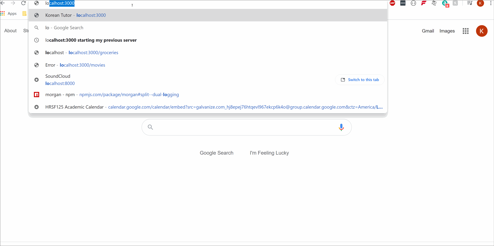

# SoundCloud Site

This is the readme file for the Post Comments and Buttons of the SoundCloud clone "SoundClone."

## Instruction for proxy server
1) Run "npm install" on package.json
2) Run "mysql -u root -p < database/schema.sql" to create database and table for mysql
    - if you run into mysql error related to issue of config.js file not find. Update "yourconfig.js" with your mysql password and update the file link at the top for "db.js" and "seed.js"
3) Run "npm run seed" to create faker data for the table

## API Call with sample Data
/songs API GET Request

